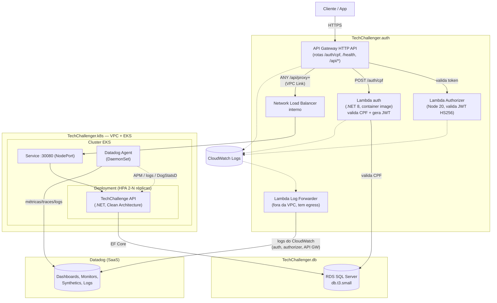

# Diagrama de Componentes

Visão de todo o sistema — nuvem (AWS), APIs, banco de dados e observabilidade — cruzando os 4 repositórios.

## Componentes por repositório

- **`TechChallenger.k8s`** — provisiona a rede (VPC, subnets públicas/privadas, Internet Gateway) e o cluster EKS com autoescala de nós (managed node group) e o registry ECR. Único repositório que possui recursos de rede/computação de base; os demais o descobrem via `data source`.
- **`TechChallenger.db`** — provisiona o RDS SQL Server Express, achando a VPC/EKS do repositório acima por tag/nome (sem acoplar states).
- **`TechChallenge`** — a API principal (Clean Architecture: Domain, Application, Infra, API), rodando como Deployment no EKS com HPA, expondo `Service` NodePort consumido pelo NLB do repositório `auth`. Inclui o agente Datadog (DaemonSet) para observabilidade de infraestrutura, APM e métricas de negócio.
- **`TechChallenger.auth`** — a camada serverless: API Gateway (roteamento e borda), Lambda de autenticação por CPF, Lambda authorizer (validação de JWT antes de qualquer chamada às rotas protegidas), NLB + VPC Link (ponte entre o API Gateway e o Service dentro do cluster) e o Log Forwarder (observabilidade da própria camada serverless).

## Por que essa topologia

- **API Gateway na borda de tudo** (inclusive na frente da API principal): um único ponto de entrada, autenticação centralizada via Lambda authorizer, sem expor o cluster diretamente à internet.
- **VPC Link + NLB interno** em vez de expor o `Service` como `LoadBalancer` público: o cluster fica em subnets sem exposição direta; o único caminho de entrada é o API Gateway.
- **Lambda de auth dentro da VPC**: precisa alcançar o RDS (mesma rede); em contrapartida, fica sem egress à internet — daí o Log Forwarder (fora da VPC) para observabilidade.
