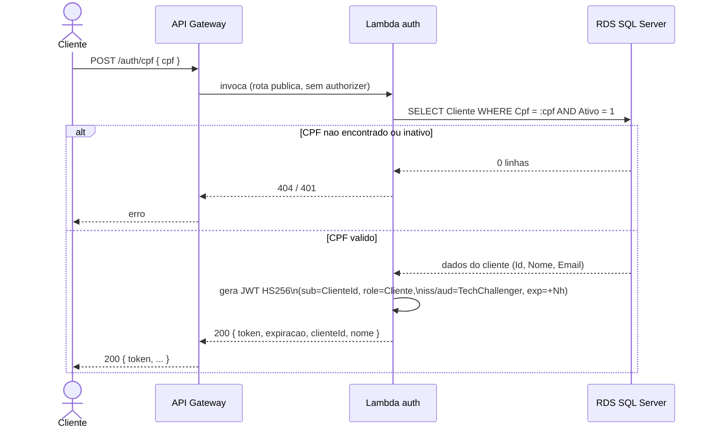
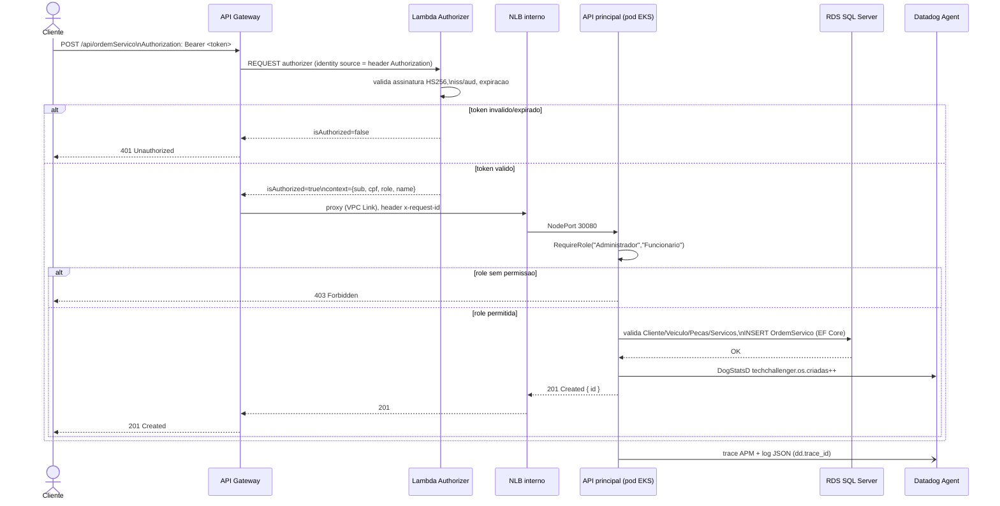

# Diagramas de Sequência

## 1. Autenticação por CPF

Chave simétrica (`Jwt:Key`) compartilhada entre a Lambda de auth e a API principal — ambas validam o mesmo token sem se comunicarem diretamente (ver [RFC-003](rfcs/RFC-003-estrategia-de-autenticacao.md)).

## 2. Abertura de Ordem de Serviço (rota protegida)

Pontos-chave:
- O **Lambda authorizer** é o único ponto que valida o JWT — a API principal confia no `role`/`sub` que chegam via claims do próprio token (também validado independentemente pelo middleware de auth do ASP.NET Core, com a mesma chave).
- Toda requisição que chega ao pod gera **trace de APM** e **log estruturado em JSON** correlacionados (`dd.trace_id`), e falhas nos casos de uso de OS emitem a métrica `techchallenger.os.erros` (ver [ADR-004](adrs/ADR-004-observabilidade-hibrida.md)).
