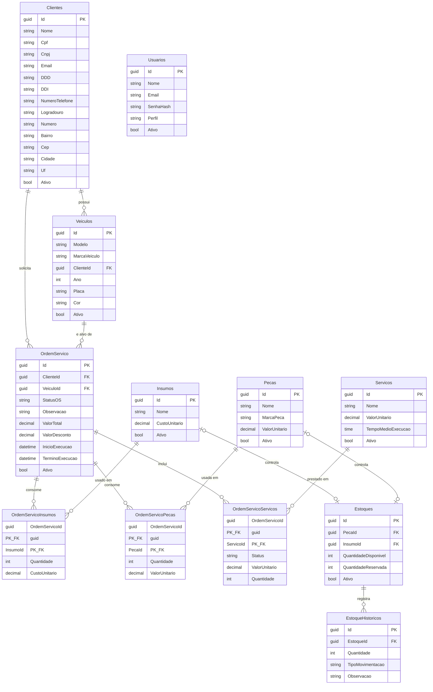

# Modelo de Dados

## Diagrama Entidade-Relacionamento

Extraído da migration real (`src/Infra/Migrations/20260712214306_initialMigration.cs`) — reflete exatamente o schema aplicado no RDS.

## Explicação dos relacionamentos

- **Cliente 1—N Veículo**: um cliente pode ter vários veículos (`FK_Veiculos_Clientes_ClienteId`, `Cascade` — remover o cliente remove os veículos associados).
- **Cliente 1—N Ordem de Serviço** e **Veículo 1—N Ordem de Serviço**: cada OS pertence a um cliente e a um veículo específico (`Restrict` em ambas — não é possível excluir um cliente/veículo com OS vinculada, preservando o histórico).
- **Ordem de Serviço N—N Peça / Insumo / Serviço**: modelado como 3 tabelas associativas com **chave primária composta** (`OrdemServicoId` + `PecaId`/`InsumoId`/`ServicoId`), cada uma carregando os atributos específicos daquela associação (quantidade, valor unitário no momento do uso, status de execução por serviço) — evita duplicar preço/custo na tabela principal e preserva o valor histórico mesmo se o cadastro de peça/serviço mudar depois.
- **Peça/Insumo 1—1(opcional) Estoque**: `Estoques` referencia `PecaId` **ou** `InsumoId` (ambos anuláveis) — mesma tabela de controle de estoque serve os dois tipos de item, evitando duas tabelas quase idênticas.
- **Estoque 1—N Histórico de Estoque**: toda movimentação (entrada/saída/reserva) gera um registro auditável em `EstoqueHistoricos` (`Cascade`), permitindo reconstruir o saldo a qualquer momento.
- **Usuários** é independente do restante — usada apenas para o login interno de staff (`Administrador`/`Funcionario`/`Mecanico`/`Almoxarifado`), com `Email` único.

## Justificativa da escolha do banco de dados

**Banco escolhido: SQL Server (Amazon RDS, edição Express).**

- **Continuidade com a Fase 1/2**: o modelo relacional, as migrations do EF Core e todo o domínio já haviam sido construídos e validados contra SQL Server nas fases anteriores do projeto. Trocar de motor nesta fase (ex. para PostgreSQL) exigiria reescrever/validar migrations e ajustar tipos específicos (`decimal(10,2)`, `time`, `nvarchar`) sem nenhum ganho funcional para o escopo desta fase — cuja entrega é infraestrutura/observabilidade, não modelagem.
- **Natureza transacional e fortemente relacional do domínio**: Ordem de Serviço tem múltiplas dependências obrigatórias (Cliente, Veículo) e associações N—N com regras de integridade (`Restrict` para preservar histórico, `Cascade` onde faz sentido apagar em cascata) — um banco relacional com FKs e transações ACID é o encaixe natural; não há necessidade de escala horizontal massiva nem de schema flexível que justificasse um banco não-relacional.
- **RDS gerenciado**: elimina o trabalho operacional de patch/backup/HA, item explicitamente pedido na rubrica ("Banco de Dados Gerenciado"). `backup_retention_period = 7` dias e `multi_az = false` (SQL Server Express não suporta Multi-AZ) — ajuste consciente para o ambiente acadêmico, documentado no repositório de infraestrutura.
- **Ajustes feitos nesta fase**: o schema em si não mudou; o que mudou foi a **infraestrutura ao redor** — RDS passou a ser provisionado em Terraform próprio ([`TechChallenger.db`](https://github.com/TechChallenge01/TechChallenger.db)), com a rede/SG descobertos por `data source` a partir do repositório de rede/cluster, permitindo escalar a infraestrutura sem tocar no domínio.

Ver também [RFC-002](rfcs/RFC-002-escolha-do-banco-de-dados.md) para as alternativas consideradas.
